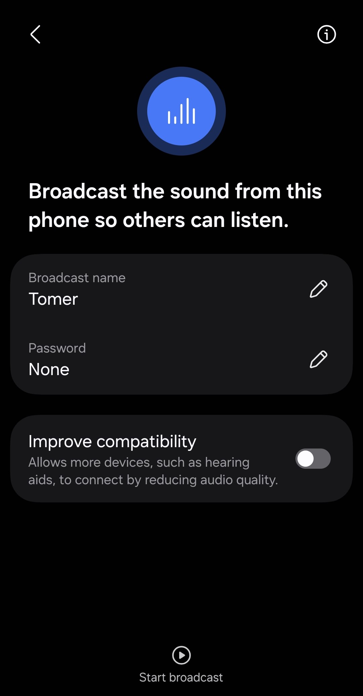

# Auracast Demo
This is a modification of Zephyr samples to quickly and transparently see how an Auracast broadcast works, if your board picks up an Auracast broadcast, and get all the details of said broadcast.

I noticed my phone is capable of Auracast broadcast (I found it under Bluetooth->Details->Broadcast sound using Auracast) and I wanted to see the details of it, so I investigated it. 
I couldn't find the details of the broadcast online, so I made this.
In the code comments is a breakdown of the raw data I got at each stage and what it means (alongside sources).

Here is the broadcasting screen on my phone: 

## Background on Auracast
I recommend reading [this short paper](https://www.arendi.ch/media/download/aau00003_whitepaper_auracast_en.pdf) for some background.

But in short: Auracast is a technology to tune in to an isochronous stream(s) without ever connecting to the broadcaster.
The process is to do an extended scan (in this code the scan done is an extended scan)-> find broadcast by name
-> sync to the periodic advertising
-> sync to the BIG (Broadcast Isochronous group)
-> sync to the BIS's (Broadcast Isochronous stream) we want (for stereo audio we want to connect to 2 streams).

Where in each step we get information (in the form of reports) to help us achieve the next step.

Some notes:

* The Bluetooth broadcast address is randomized each time you start a broadcast (so our phone's Bluetooth address is not useful). So, we have to use the broadcast name (found in the data from an extended scan) to connect to the right broadcast. The broadcast name only appears when you scan for extended advertising.

* Auracast does not require the receiver to pair or connect to the transmitter. The receiver merely listens to the data. This means that a truly unlimited number of devices can tune in for the broadcast.

* Bluetooth adv data is comprised of LTV (length type value) data structures in a series.

* Only when audio is actively playing on the phone, is audio data transmitted in the broadcast.

* Note that using the "Improve compatibility" option for the Auracast broadcast on the phone still gives us 2 separate left and right streams as opposed to 1 mono stream. The difference turning it on makes is that then it uses a 
standard quality Public Broadcast audio configuration instead of a high quality one. 